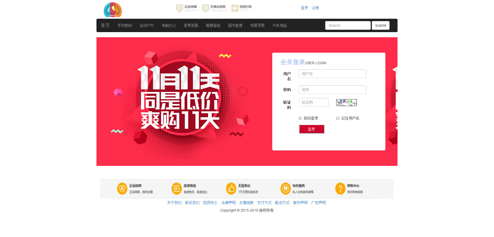
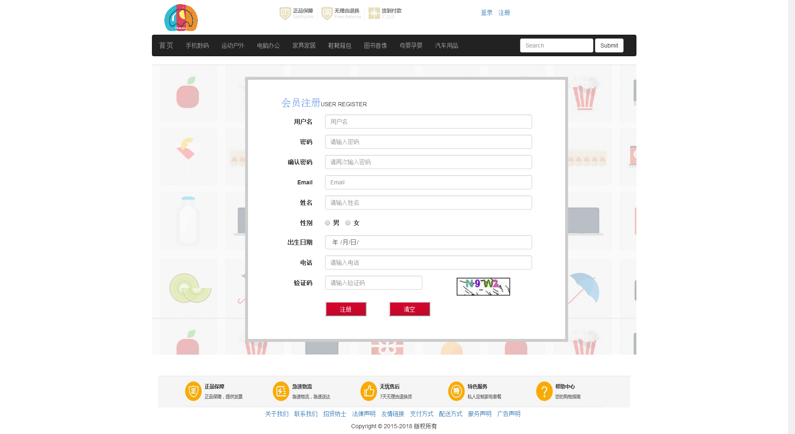
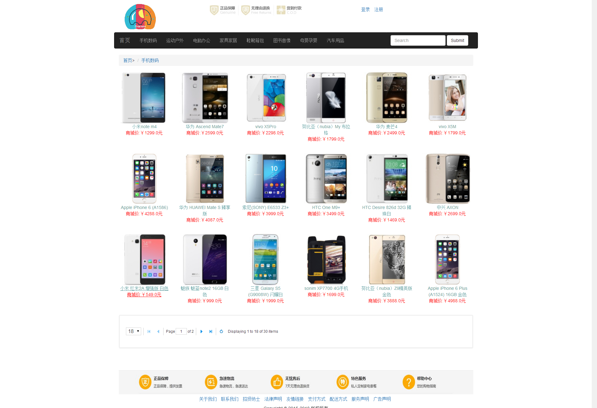
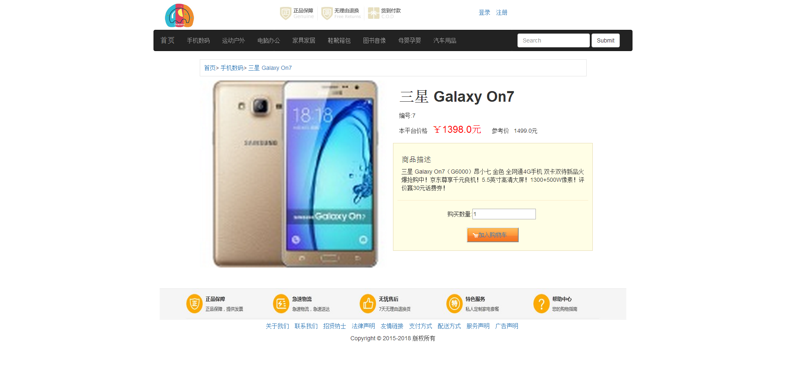
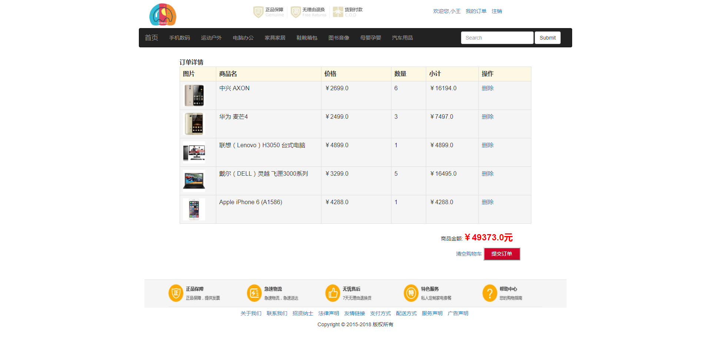

#网上商城
##技术点
* jsp+servlet
* tomcat:服务器组件
* mysql:数据库
* c3p0:数据库连接池
* dbutils：数据库操作工具类
* filter:过滤器 过滤编码问题和自动登录
* javamail:自动发送邮件激活账号
* cookie : 客户端自动登录
* session : 服务器端全网登录
* json: 部分前后端数据传输
* Redis : 内存Nosql数据库
* easyui : 分页控件

##功能点
1. 用户模块
   * 用户登录|登出|注册|验证码|用户名是否存在等
   * 自动发送邮件激活
   * 自动登录 (Cookie+Session+Filter)
   * 全网登录
2. 商品模块
   * 分类常用查询采用Redis内存数据库做缓存
   * 最热商品
   * 最新商品
   * 商品详情
   * 商品分类
   * 商品分页
3. 购物模块
   * 未登录拦截
   * 选择商品和数量添加进购物车
   * 购物车展示
   * 自动计算单品总价和购物车总价
   * 单品删除
   * 全部删除
   * 我的购物车
   * 生成订单
4. 订单模块
   * 订单生成
   * 收件人信息
   * 订单支付(采用易宝支付)
   * 我的订单(订单中心)
5. 后台模块
   * 后台分类管理(增|删|改|查)
   * 后台商品管理
--------------------
### 部分截图 ###
 
 
 
 
 
 
 
